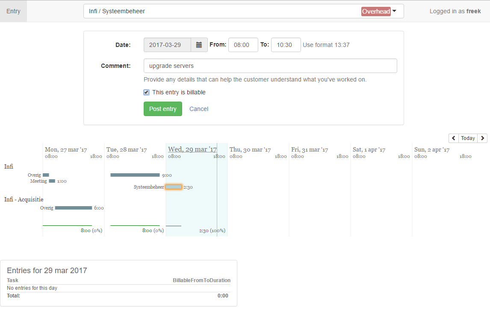

# Alibi Time Tracker



This is the source code for a time tracking solution we use at [Infi](https://infi.nl). It is written in Clojure(Script), and uses a lot of Domain-Driven Design principles. As such, it aims to provide an example codebase for a realistic Clojure application, a realistic DDD application and the both of them together. That being said, there are probably a lot of issues with this code base from both a Clojure as well as a DDD point of view. I'm happy to hear about these, so we can improve this codebase.

I wrote some rationale about the goals and design/architecture at http://www.freekpaans.nl/2016/01/moving-away-from-legacy-using-ddd/ and http://www.freekpaans.nl/2016/03/layered-architecture-in-clojure/.

## Features

This is far from a fully fledged time tracker, yet it has the following features, and more is on the way!

* Categorize time entries by project and task.
* Graphical overview of your weekly activity.
* Indicate whether entries are billable or not.
* Tasks have an associated billing method, either fixed price, overhead or hourly.
* Create projects and tasks via a CLI, and the repl.
* Extension points for a different data source implementation.
* OpenID Connect and single user authentication.
* Out of the box Sqlite3 database support.


## Getting started

## Docker

If you just want to play around a little you can do that by running the docker image:

    docker run -p 3000:3000 infinl/alibi-demo

Open http://localhost:3000 in the browser and you should be able to fiddle around.

### Run with leinigen

Make sure [leiningen](https://leiningen.org/) is installed.

Clone the repo. Then, inside the repo, create a sqlite db:

    lein run sqlite create-db :filename "alibi.db"

This will create a sqlite3 db with filename `alibi.db`, which contains the right schema, but has no data. Before we create some data, we first need to setup a config file
```
cat << EOF > config/local/config.edn
{:cookie-encryption-key "xxxxxxxxxxxxxxxx"
 :selmer-caching? false

 :persistence :sqlite
 :persistence-strategies {}
 :sqlite {:subprotocol "sqlite" :subname "alibi.db"}

 :authentication :single-user
 :single-user {:username "me!"}}
EOF
```

Replace the `:cookie-encryption-key` value with your own key (generate one with `openssl rand -base64 12`) and `[:sqlite :subname]` with the database file you picked in the previous step. Have a look at `config/config.edn` for more config options, including how to use OpenID Connect for authentication.

Now we can populate the database with some projects and tasks:
```
lein with-profile local run projects create :name "Alibi" :billing-method :hourly
# => Will return an id for the newly created project, use that for "1" in the following steps
lein with-profile local run tasks create :name "Project management" :for-project 1 :billing-method :overhead
lein with-profile local run tasks create :name "Programming" :for-project 1
```

Compile the ClojureScript:

```
lein cljsbuild once
```

Run the server:
```
lein with-profile local ring server-headless
```

If everything went well, there should now be a web server running on http://localhost:3000. Navigate to it and have fun!

## Building a Docker image

You can run Alibi in a Docker:

    docker build . -t infi/alibi

    # Create project "Alibi" with one regular and one overhead-task
    docker run -v /local/path/to/data:/opt/alibi/data infi/alibi app:projects create :name "Alibi" :billing-method :hourly # returns <id>
    docker run -v /local/path/to/data:/opt/alibi/data infi/alibi app:tasks create :name "MyTask" :for-project <id>
    docker run -v /local/path/to/data:/opt/alibi/data infi/alibi app:tasks create :name "MyOverheadTask" :for-project <id> :billing-method :overhead

    # Run the application
    docker run -v /local/path/to/data:/opt/alibi/data -p 3500:3000 infi/alibi

Alibi should now be running at http://localhost:3500.

## Acknowledgements

This project uses a lot of open source tooling, which I am graful for. In no particular order:

* Clojure(Script)
* ring
* compojure
* celmer
* clj-time
* bouncer
* MySQL
* Jetty
* Buddy
* Sqlite3
* Figwheel
* Sablono
* Cljsbuild
* Cider
* JSJoda
* Selectize
* JQuery
* React
* Leiningen


If you find your project in the source, but isn't listed: I'm sorry! Please drop me a note and I'll add yours.

## License

Copyright © 2017 Infi Holding B.V. and contributers.

Distributed under the Mozilla Public License Version 2.0
